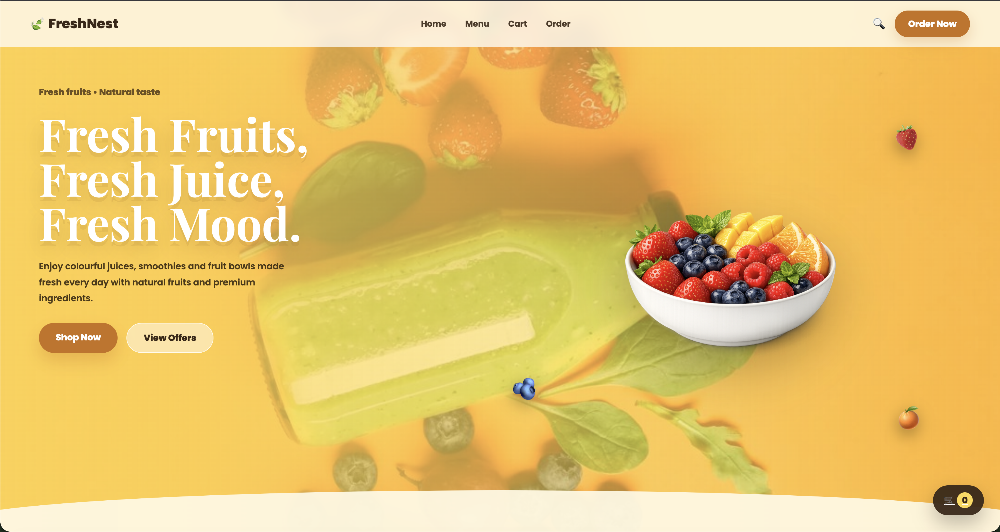
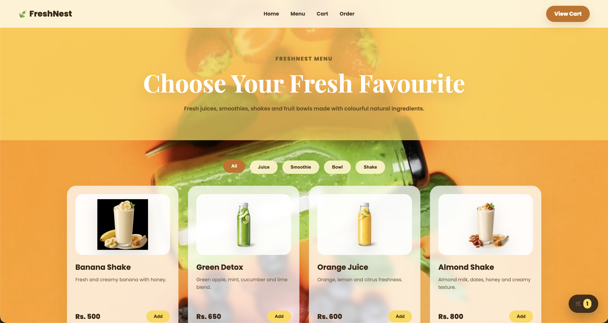
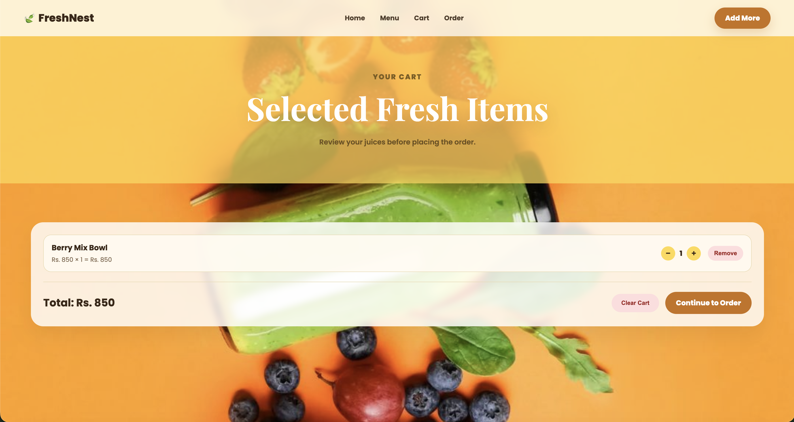
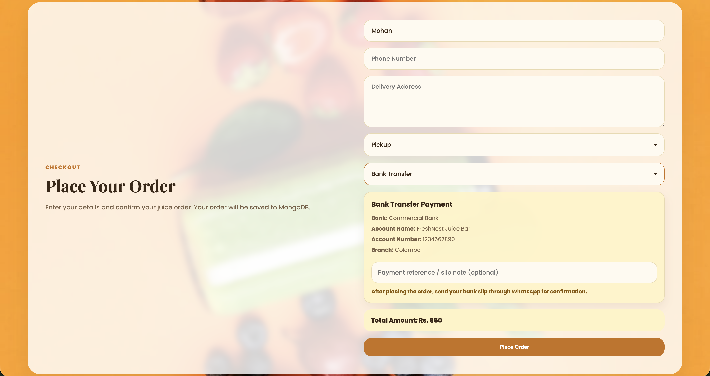
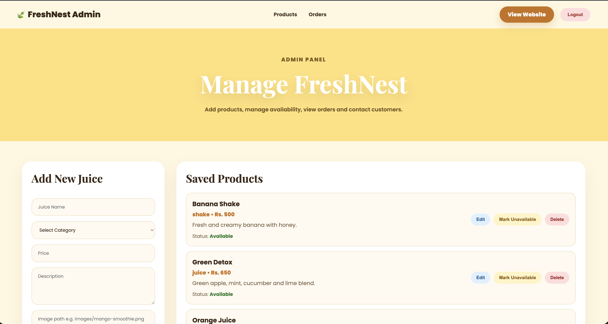
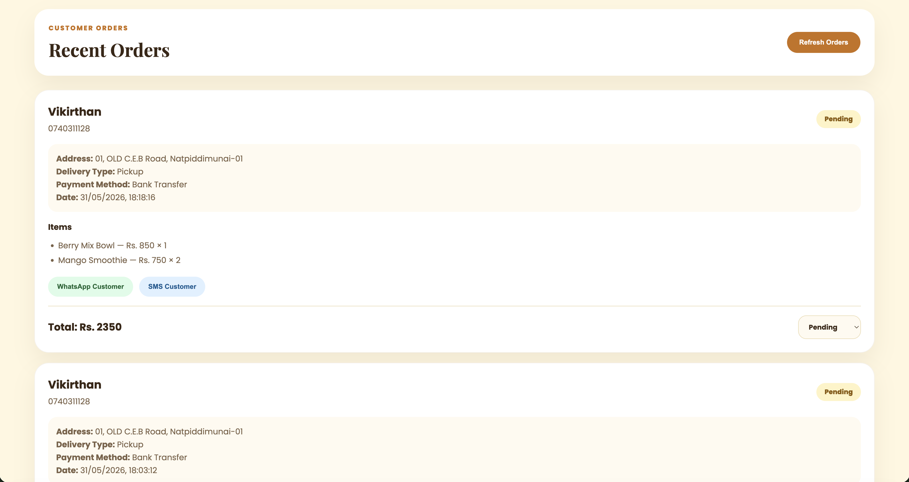
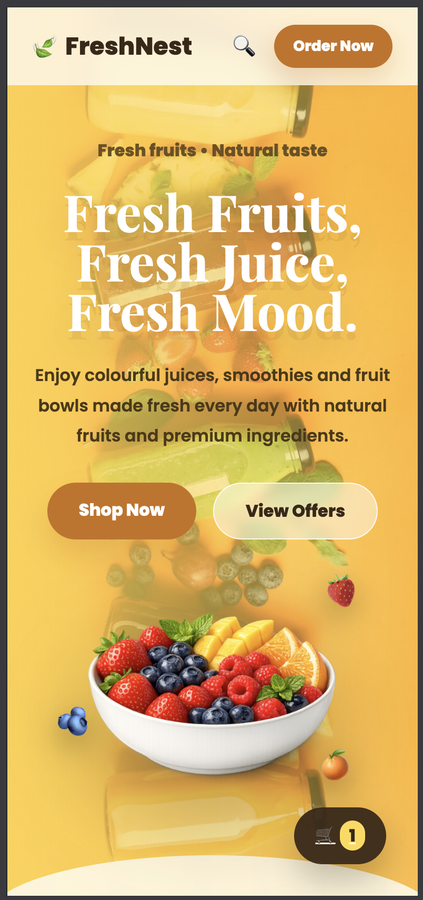

# FreshNest - Fresh Juice Ordering Website

FreshNest is a fully functional fresh juice ordering web application built for small juice shops, cafes, and smoothie businesses. Customers can browse products, add items to cart, place orders, and confirm orders through WhatsApp. The admin can manage products, view orders, update order status, and contact customers through WhatsApp or SMS.

## Features

### Customer Features
- Modern fresh juice website design
- Mobile responsive layout
- Menu page with category filters
- Add products to cart
- Cart quantity update and remove item option
- Checkout form with customer details
- Delivery and pickup options
- Payment methods:
  - Cash on Delivery
  - Bank Transfer
  - Pay at Shop
- Bank transfer reference note
- WhatsApp order confirmation
- Floating cart counter

### Admin Features
- Secure admin login
- Add new juice products
- Edit existing products
- Delete products
- Mark products as available or unavailable
- View customer orders
- View ordered items, total amount, delivery type, payment method, and payment reference
- Update order status:
  - Pending
  - Preparing
  - Delivered
  - Cancelled
- Contact customer through WhatsApp
- Contact customer through SMS

## Tech Stack

### Frontend
- HTML
- CSS
- JavaScript

### Backend
- Node.js
- Express.js
- MongoDB
- Mongoose
- JWT Authentication
- bcrypt.js

### Database
- MongoDB Atlas

## Live Demo

Frontend: https://freshnest-juice-ordering-web-app.netlify.app

Backend API: https://freshnet-juice-ordering-web-app-production.up.railway.app

## Screenshots

### Home Page



### Menu Page



### Cart Page



### Checkout Page



### Admin Product Management



### Admin Order Management



### Mobile View



## Project Structure

```txt
FreshNest
├── backend
│   ├── middleware
│   ├── models
│   ├── routes
│   ├── .env.example
│   ├── .gitignore
│   ├── package.json
│   └── server.js
│
├── frontend
│   ├── css
│   ├── images
│   ├── js
│   ├── admin.html
│   ├── cart.html
│   ├── index.html
│   ├── login.html
│   └── menu.html
│
├── screenshots
└── README.md